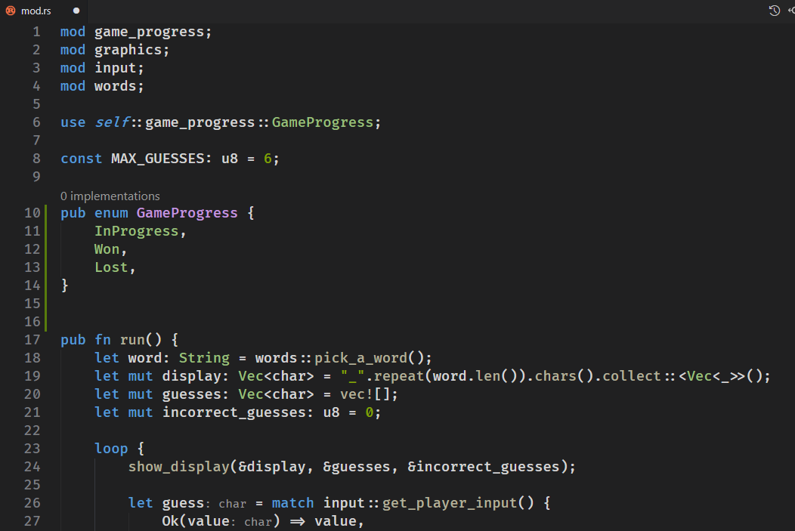

 
 
 # Akaroa Theme
  

A dark theme for Visual Studio Code 

## Feedback

* Working in progress for some lenguages. There are still some adjustments to be made.

## License

Licensed under the [MIT](LICENSE) license.

## Author

* **Igor Couto** - [igor.fcouto@gmail.com](mailto:igor.fcouto@gmail.com)

**Enjoy!**
